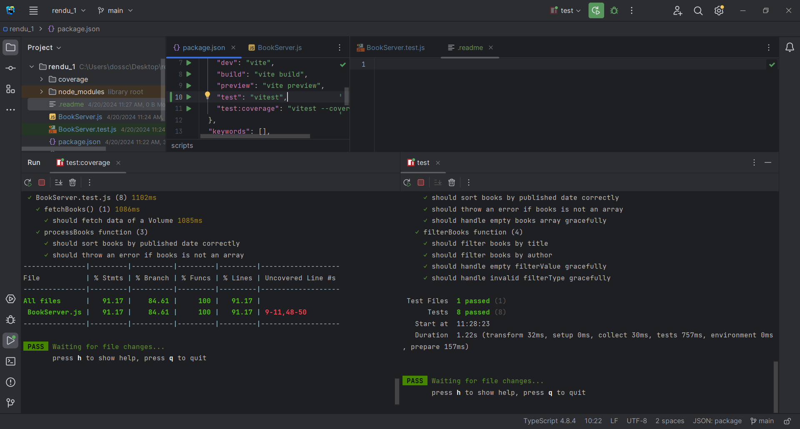

# BookServer Functions

This repository includes functions for managing book data using the Books API.

---
## Installation

Clone the repository and install dependencies using npm:

```
git clone https://github.com/your-username/BookServer.git
cd BookServer
npm install
```

## Usage

### `fetchBooks()`

This function retrieves data of volumes from the Books API.

```javascript
export async function fetchBooks() {
  try {
    const response = await fetch(
            "https://www.googleapis.com/books/v1/volumes?q=javascript&maxResults=10",
    );
    const data = await response.json();
    return data.items;
  } catch (error) {
    console.error("Error fetching books:", error);
    return [];
  }
}
```

### `processBooks(books)`

This function sorts an array of books by their published date.

  ```javascript
  export async function processBooks(books) {
  try {
    if (!Array.isArray(books)) {
      throw new Error("Books must be an array");
    }
    let processedBooks = [...books];
    processedBooks.sort(
      (a, b) =>
        new Date(a.volumeInfo.publishedDate) -
        new Date(b.volumeInfo.publishedDate),
    );
    return processedBooks;
  } catch (error) {
    console.error("Error processing books:", error);
    return [];
  }
}
  ```

### `filterBooks(books, filterType, filterValue)`

This function filters an array of books based on the filter type and value.

```javascript
export async function filterBooks(books, filterType, filterValue) {
  try {
    let filteredBooks = [...books];
    filteredBooks = filteredBooks.filter(
      (book) =>
        book.volumeInfo.title
          .toLowerCase()
          .includes(filterValue.toLowerCase()) ||
        (book.volumeInfo.authors &&
          book.volumeInfo.authors.some((author) =>
            author.toLowerCase().includes(filterValue.toLowerCase())
          ))
    );
    return filteredBooks;
  } catch (error) {
    console.error("Error finding books:", error);
    return [];
  }
}
```
## Testing

To run the provided test cases, use the `vitest` framework:

```
npm test
```

## Testing Examples

Refer to `BookServer.test.js` for examples of how to test these functions using `vitest`.



_---_
